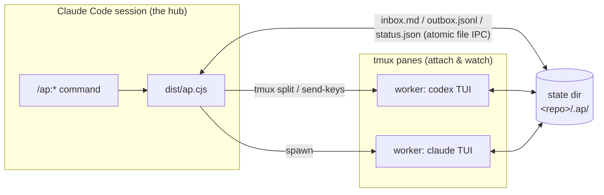
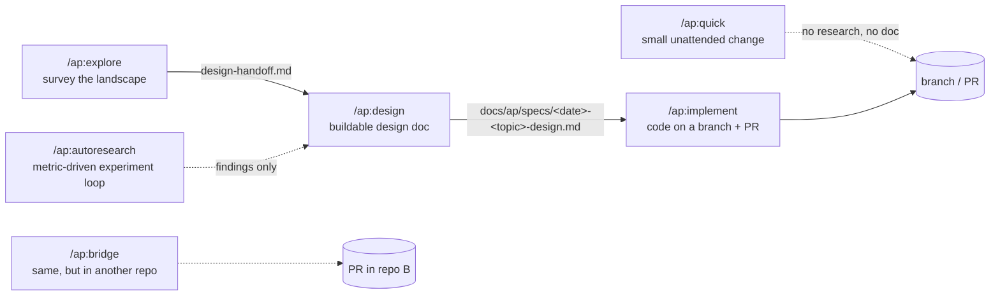

# agglomeration-platform

[](https://github.com/WingsOfPanda/agglomeration-platform/actions/workflows/ci.yml)
[](LICENSE)

**Multi-model tmux orchestration for Claude Code.** A **hub** — a Claude Code session running
`/ap:*` slash commands — spawns and steers real interactive model TUIs (`codex` / `claude` /
`agy` / `opencode`) as **tmux panes you can attach to and watch**. Coordination is file-based IPC
(inbox / outbox / status / pane), so the external model binaries behave exactly as they do on
their own — agglomeration-platform just orchestrates them.

The platform agglomerates agents: the orchestrating session is the **hub**, each model TUI is an
**agent**, a spawned agent working a task is a **worker**, and agents are grouped into color-coded
**clusters** (azure / sage / amber / slate / ivory / violet) so concurrent panes stay visually
distinguishable. The commands are plain verbs — `quick`, `explore`, `design`, `implement`,
`autoresearch`, `review` — and an `implement` or `quick` run can go **detached**: the whole
pipeline drives itself in its own tmux session while your Claude Code session stays free
([details below](#detached-jobs---detached)).

---

## What's new

The most recent releases, newest first. Every entry has a dated design record under
`docs/superpowers/specs/`; the full history is `git log`.

- **0.5.89 — 2026-09-06 · scope paths as designs write them.** `implement scope-check` matches a
  Components or Testing path written absolute under the target or the main checkout by its
  repo-relative form (`SCOPE_RELATIVIZED=`), so an absolute-citation design no longer reads as a
  whole-diff out-of-scope; a `:line` suffix on a declared path is ignored everywhere; the warn-only
  audit lint skips a line labelled `(new — does not exist yet)` and a bare filename. A doc citing
  `src/a.ts:12` now resolves to the file, so a path the suffix used to hide can newly appear in
  `INVISIBLE_IN_TARGET` or a quick brief's `STATE_RELATIVE` lint. Closes #208, #215.
- **0.5.88 — 2026-09-06 · `/ap:review` reads issues with `--json`.** The triage directive's read step
  used `gh issue view --comments`, which fails on gh releases that still query Projects (classic)
  (gh 2.45, the release Ubuntu packages); it now uses `--json number,title,body,comments` with a
  `--jq` render, which requests only the fields it names and works on every gh release.
- **0.5.87 — 2026-09-06 · parked stays parked.** A detached job hub's `progress` heartbeat while it
  waits on an operator question no longer un-parks the question: `job relay` accepts while nothing but
  progress follows it, `job status`/`attach` keep `PARKED=yes`, and a heartbeat logged after the relay
  cannot re-park an answered question (the consumed check now compares the relay cursor against the
  question's own offset). A relayed answer no longer carries the generic done-event footer. Closes #242.
- **0.5.86 — 2026-09-06 · `.ap-provision`.** A repo commits `.ap-provision` at its root, one git
  pathspec per line, and every ap worktree — a detached run's and each slice worker's — receives the
  gitignored artifacts it names, copied from the main checkout at launch: enumerated per line with
  `git ls-files --others --ignored --exclude-standard`, so only ignored files ever cross; a copy, never
  a hardlink; every path named on stderr. The second half of the worktree-parity design, unblocked by
  its first dogfood.
- **0.5.85 — 2026-09-06 · Detached `implement`: the job hub's own rules.** The waits, the relay,
  the park, the sends and every rc-bearing verb are the hub's own turn; a slice's claim check runs
  inside that slice's worktree; one park at a time, so a second question is never swallowed by the
  relay's cursor; roster-mutating verbs run one at a time.
- **0.5.84 — 2026-09-05 · Detached `quick`: worktree-aware delegation.** The job brief tells the
  hub that its own pane sits in the main checkout, so every command about the run's code names the
  worktree; in-flight subagents are cancelled before any terminal event; the reply to a worker's
  question is the hub's own attestation.
- **0.5.82 — 2026-09-05 · One session, one window.** A detached `implement` run's slice workers
  are panes in the job hub's window — hub on the left, the lead and every slice stacked evenly on
  the right, the layout `/ap:design` has — never a second window. The detached session is created
  at 240×100 so the stack fits before you attach; a window too small for the lead plus every slice
  degrades to the serial path with a `parallel-degraded` flag.
- **0.5.73–0.5.83 — 2026-09-05 · The delegation contract.** Every worker identity, the detached
  job hub and every attached hub (design on both its paths, quick, implement, explore, bridge,
  autoresearch) carry one rule for models with an orchestrator/executor split (codex's Astra→Sol,
  Claude's Fable→Opus): grind — reading diffs, logs and artifacts, repository sweeps,
  implementation against a brief — goes to cheaper execution subagents, while the brief, the
  verdict, the gate run and every citation stay first-hand. Along the way autoresearch's stale
  probe stopped clobbering the worker's done contract, and a queued `stale`/`stuck` is superseded
  by a newer `done` (0.5.75, 0.5.81).
- **0.5.70–0.5.72 — 2026-09-04/05 · Parallel slices.** On a detached `implement` run the lead
  writes the plan with a Slices proposal, the job hub groups the tasks (up to 6 slices, no flag, no
  worker count to choose), each slice implements in its own worktree and branch, `integrate` merges
  them and the lead absorbs what is left. A plan that does not split falls back to the single lead
  at the cost of one plan turn. A premature `done` is held on pane activity instead of failing the
  turn.
- **0.5.66–0.5.68 — 2026-09-03/04 · Worktree environment parity, prompt audit.** `job start`
  detects a `.pth` or editable install that resolves the repo from your main checkout and pins
  `PYTHONPATH` to the worktree for the worker and for the hub's own gate; a directive-wide prompt
  audit fixed five real prompt bugs.

---

## The picture



What your terminal actually looks like mid-run — the hub keeps its pane, every worker is a real
pane with a color-coded border label:

```
┌──────────────────────────────┬──────────────────────────────┐
│ hub — Claude Code            │ [azure] mike-codex · topic    │
│ > /ap:design "..."           │  codex TUI, working…          │
│   design research-wait …     ├──────────────────────────────┤
│                              │ [sage] victor-claude · topic  │
│                              │  claude TUI, working…         │
└──────────────────────────────┴──────────────────────────────┘
```

And the intended flow between commands:



`check` / `list` / `job` / `review` / `stop` are the operational glue around all of it.

---

## Install

agglomeration-platform ships as a Claude Code plugin via its own marketplace:

```
/plugin marketplace add WingsOfPanda/agglomeration-platform
/plugin install ap@agglomeration-platform
```

To update later: `/plugin` → update `ap`, then `/reload-plugins`. There is no build step —
`dist/ap.cjs` is committed.

### Requirements

- **Claude Code** — the hub runs as a Claude Code session.
- **tmux ≥ 3.0**. Attached runs split the hub's own pane, so the hub session must run **inside
  tmux**; a `--detached` launch creates its own session, so for those the hub only needs the tmux
  binary on `PATH`.
- **At least one model CLI on `PATH`, installed *and logged in*** — `codex`, `claude`, `agy`, or
  `opencode`. Workers inherit your existing CLI auth; a CLI that is installed but not authenticated
  shows up as a worker that never reports ready (a bootstrap timeout), not as a clear error. Run
  `/ap:check` to detect what is available and pick your active set.

> **Security posture, stated plainly:** in the default `full` mode, workers are launched with
> their CLI's permission-bypassing flag (e.g. `codex --dangerously-bypass-approvals-and-sandbox`,
> `claude --permission-mode auto`). Sandboxing is honor-system; workers can run shell commands and
> reach the network. Point the platform only at repositories and tasks you would trust an
> unattended agent with. `/ap:autoresearch` states this loudest in its own directive.
> Separately, ap files each run's diagnostics — topic, hostname, username, paths, worker output and
> hub notes, with credential-shaped strings scrubbed — as issues on the **public** repo
> `github.com/WingsOfPanda/agglomeration-platform`, so the maintainers see what broke on your box.
> It asks once per machine before the first filing; decline with `ap review consent no` (or answer
> "Never on this machine"), and records stay in a local queue instead.

### Five-minute start

1. Install (above), open a Claude Code session **inside tmux** in the repo you want to work on.
2. `/ap:check` — verifies tmux/state/config, detects model CLIs, lets you pick the provider set.
3. `/ap:quick "rename FooService to BarService and fix all call sites"` — one worker implements
   it unattended on its own branch; the hub briefs, verifies, and (by default) pushes + opens a PR.
   For a first try on a repo you care about, add `--no-finish` — the branch stays local and nothing
   is pushed until you say so.
4. Watch it live: the worker is a tmux pane — click into it or `tmux select-pane`.
5. `/ap:list` shows active workers; `/ap:stop <topic>` tears down and archives.

When the task needs research before code, use the pipeline instead:
`/ap:explore` → `/ap:design` → `/ap:implement` (worked example below). When a run will take
hours, add `--detached` — it moves the whole pipeline into its own tmux session and gives you
your session (and your checkout) back ([details](#detached-jobs---detached)).

---

## Which command do I want?

| You want… | Reach for |
|---|---|
| A small, clearly-specified change made unattended | [`/ap:quick`](#apquick) |
| To survey SOTA / think from multiple angles, **without** committing to a plan | [`/ap:explore`](#apexplore) |
| A buildable, audited design doc ("design X", "should we adopt X?") | [`/ap:design`](#apdesign) |
| To turn a design doc into code, cross-verified, on a branch | [`/ap:implement`](#apimplement) |
| An implement/quick run that takes **hours** — without holding your session hostage | [`--detached`](#detached-jobs---detached) + [`/ap:job`](#apjob) |
| A metric-driven experiment loop that never touches real code | [`/ap:autoresearch`](#apautoresearch) |
| The same orchestration, but the work belongs in a *different* repo | [`/ap:bridge`](#apbridge) |
| Health check + pick which model CLIs to use | [`/ap:check`](#apcheck) |
| See / end running workers | [`/ap:list`](#aplist) · [`/ap:stop`](#apstop) |
| Review the problems your past runs recorded | [`/ap:review`](#apreview) |

---

## Commands

### `/ap:quick`

```
/ap:quick "<task text>" [--detached] [--provider codex|claude|agy|opencode] [--no-finish] [--stash-wip]
```

The light pipeline: **one worker implements a clear single-repo change unattended** on its own
`feat/quick-<topic>` branch — no research, no design doc, no interactive gates. The hub writes the
brief, waits, verifies, and finishes.

- **Finishing is the default**: with a git remote, the branch is pushed and a PR opened; without
  one, the branch is kept and your starting branch restored. `--no-finish` keeps it local.
- `--stash-wip` parks any pre-existing uncommitted WIP in an identity-checked git stash before the
  branch forks, so the PR carries only the worker's commits, and restores it at finish.
- You get: the branch/PR, a `SUMMARY.md`, archived worker state, and forensics for `/ap:review`.

`--detached` runs the whole thing as a background job in its own tmux session and worktree —
see [Detached jobs](#detached-jobs---detached).

When the task is fuzzy, contested, or architectural — don't `quick` it; run the pipeline.

### `/ap:explore`

```
/ap:explore <topic — what to survey / think deeply about>
```

Deep multi-aspect exploration: N workers research the topic in parallel (with a literature-weight
classifier steering how academic each worker goes), then the hub synthesizes a landscape draft,
runs a confidence gate, and — unless the gate passes — sends **every worker back as an adversary
against the synthesis**, with rebuttal, gap-enrichment, and sign-off rounds. The hub itself never
retrieves; workers are the only searchers.

- You get (in the archived run dir): `landscape-<date>-<topic>.md` (approaches, tradeoff matrix,
  contested claims, citations), `design-handoff.md` (the seed for `/ap:design`), and a
  per-worker contribution scoreboard. The Conclusion is printed to chat.
- The suggested next step is printed verbatim: `/ap:design <archive>/design-handoff.md`.

Explore answers *"what's out there and what should we think?"* — it deliberately does **not**
produce a buildable plan. That's design's job.

### `/ap:design`

```
/ap:design [--ensemble] <topic — what to research / design>
```

Cross-verified multi-model investigation that ends in **one deploy-schema design doc** (Problem /
Goal / Architecture / Components / Testing / Success Criteria) which must pass a mechanical
deploy-audit gate. Routing is automatic: simple topics take a hub fast-path; conflicting evidence,
high stakes, or `--ensemble` escalate to a 2–3 worker ensemble that researches independently,
N-way-diffs its findings, cross-verifies each other's solo claims, and adjudicates — then the hub
walks the six sections with you interactively.

- You get: `docs/ap/specs/<date>-<topic>-design.md` — exported into your repo as the primary,
  discoverable copy — plus the full research trail in the archived run dir.
- Feed it an explore handoff for grounded research, or a raw topic for a fresh investigation.
- Every path the doc's Components section cites must exist in the checkout: assembling the doc (and
  `implement`'s later audit of it) warns on each one that does not, since a phantom path costs the
  implementing worker a question round. Tag a line `[on-box]` for paths that deliberately live
  elsewhere — a box-local config, a sibling repo — and that line is exempt. The warning never fails
  the run; the deploy-audit gate alone decides pass/fail.

### `/ap:implement`

```
/ap:implement [<design-doc-path>] [--detached] [--no-branch] [--topic <slug>] [--max-rounds N]
```

Turns a deploy-schema design doc into code, single-repo. The doc is **audited first** (schema
gate); one worker plans, implements, and self-verifies on `feat/implement-<TOPIC>` while the hub
**cross-verifies with its own independent test re-run** — the worker's green log is a claim, not
evidence — and drives a bounded fix-loop (default 5 rounds). Worker objections and questions are
relayed to you with verified claims attached.

- With no doc path, the newest exported design doc is offered.
- Ends with a finish menu — **merge / push+PR / keep / discard** — then scope-conformance check,
  forensics, teardown, archive.
- The worker pane stays attached the whole run; `tmux select-pane` to watch it code.

### Detached jobs: `--detached`

An attached run holds your session for its whole duration and dies with it. `--detached` hands the
**entire pipeline** — not just the worker — to a **job hub**: a `claude` TUI spawned into a
detached tmux session `ap-<topic>`, which runs the same directive itself and spawns its own worker
beside it. Your session gets the launch back in about a minute and keeps only a cheap watch — a persistent
monitor, not a shell, so it can be parked and re-armed across your session's restarts while the
run itself never notices.

```
your session (the origin hub)             tmux session ap-<topic> (detached) — one window
  /ap:implement <doc> --detached  ──▶     left:  claude TUI — the job hub, runs the pipeline
  /ap:job status|attach|relay             right: the lead worker's TUI, and on a fanned-out
  …free for other work…                          implement run one more pane per slice worker
                                          (tmux attach -t ap-<topic> to watch them all, live)
```

The unattended envelope is deliberately tighter than an attended run:

- **The run gets its own checkout.** `job start` forks your committed HEAD into a worktree at
  `.ap/worktrees/<topic>` and points the worker there (born on a throwaway `base/<topic>` branch;
  `node_modules` is hardlink-cloned when present, so the suite runs immediately). *Your* checkout
  stays yours for the whole run: edit it, switch branches, start other runs — just don't check out
  the run's own `feat/...` branch, and leave that topic's `.ap` state alone. Your uncommitted work
  stays behind (the launch warns when the tree is dirty). `job stop` removes the worktree — and its
  base branch — when clean, and keeps and names it when not. `--no-worktree` opts out, for a repo
  whose suite only runs in the blessed checkout.
  - *Python repos:* if a user-site `.pth` or an editable install resolves the repo from your main
    checkout, `job start` says so and pins `PYTHONPATH` to the worktree for the worker's pane and
    for the hub's own test re-run, and the brief tells the hub to prefix the same pin on anything it
    runs itself. Undeclared gitignored build products do not come across — the brief says to rebuild
    them in the worktree — and `job stop` keeps a worktree an editable install has been pointed at.
  - *Gitignored build products:* commit a `.ap-provision` at the repo root — one git pathspec per
    line, `#` comments allowed — naming the ignored artifacts a run needs (a compiled extension, a
    native build product). At launch ap enumerates each line with `git ls-files --others --ignored
    --exclude-standard`, so only gitignored files ever cross — never a tracked file, never your
    uncommitted work — and copies them into the worktree (a copy, not a hardlink, so an in-place
    rebuild there cannot write through into your checkout). Every provisioned path is named on
    stderr; a line that matches nothing, is rejected, or fails to enumerate warns and provisions
    nothing.
- **An `implement` job fans out when the plan allows it.** The lead writes `plan.md` with a Slices
  proposal, the job hub groups the tasks (up to 6 slices; there is no flag and no worker count to
  choose), and each slice implements its own tasks in its own worktree at
  `.ap/worktrees/<topic>.<agent>` and its own pane on the right. `integrate` merges the slice
  branches into the run branch and the lead absorbs conflicts, abandoned tasks and out-of-slice
  changes in one more turn. A plan that does not split — a linear dependency chain — runs serially
  with the lead and files a `parallel-degraded` flag; you lose one plan turn, nothing else.
- **Nothing merges or publishes while nobody is watching.** The finish action is locked to `keep` —
  mechanically, in the finish verbs, not just in prose, and with no flag to loosen it — so the run
  ends on its `feat/...` branch and *you* run the finish menu afterwards. When you do, integrate
  through a **PR, never a local merge**. The reason is stale base, not squeamishness: the hub
  cross-verifies against the commit the run forked from, and main keeps moving under a multi-hour
  job — a PR re-tests against current main, a local merge integrates code nobody checked against it.
  `job stop` prints the exact push + `gh pr create` commands along with how far main has drifted
  since the fork.
- **`--budget-hours` (default 6)** is checked at every round boundary; an exhausted budget writes
  `RESUME.md` and **parks** rather than continuing or discarding.
- **Park-and-relay instead of questions.** Where the attached run would ask you, the job hub
  appends a `question` event and waits. Your session surfaces it (`job wait` / `job status` /
  `job attach` all show it) and `/ap:job relay` delivers your answer; the run resumes where it
  parked.
- Whole-topic `ap stop <topic>` **refuses** while a job is in flight (it would kill the job hub —
  a worker under its own topic); `ap job stop` is the whole-job teardown, and it sweeps the
  detached session only when every pane in it is provably the platform's.

### `/ap:job`

```
/ap:job status|attach|relay|list|stop <topic> [message]
```

The origin session's view of a detached run. Jobs are **started** by `--detached` on
implement/quick, not here.

- **`status <topic>`** — one screen: what was launched, hub liveness (three-valued: `alive` /
  `dead` / **`unknown`** — an unverifiable pane is never reported dead), elapsed vs budget, the
  event tail, and any **parked question**.
- **`attach <topic>`** — after your session restarted: prints the re-arm block (watch command,
  wait command, outbox path) plus the parked state, so a job waiting on you is the first thing
  you see. The job itself never noticed your restart.
- **`relay <topic> "<answer>"`** — answer a parked question. Refuses (rc 1) when nothing is
  parked — the hub is working or finished, and a write then would clobber its task.
- **`list`** — every job in this repo (also appended to `/ap:list` as a `DETACHED JOBS` section).
- **`stop <topic>`** — tear down the hub and its workers, sweep the `ap-<topic>` session
  (ownership-gated), print the finish hint, sweep the run's worktree (clean ones only), clear the
  record. An incomplete teardown exits 1 and **keeps** the record — it is the guard that stops the
  next `job start` from adopting a leftover session by name.

### `/ap:autoresearch`

```
/ap:autoresearch <objective> [--metric k=v,...] [--time-budget none|<N>h] [--seed-from <path>] [--autonomous]
```

The heavyweight loop: lock a **measurable metric**, sweep SOTA once, spawn 2–3 persistent `codex`
workers, and adaptively dispatch single-config experiments until a stop condition — target met,
plateau, or budget. **Explore-only: it never touches your real repo.** Promotion to real code is
`/ap:implement`.

What makes it trustworthy is the **research-validity layer** — a worker's self-reported metric is
treated as a claim, not evidence:

- the hub **re-runs each result's scoring step** outside the worker's pane and adjudicates;
- mechanical **sanity/integrity gates** (ceiling, under-run, log-contradiction, config drift);
- **INFEASIBLE vs REFUTED** — a botched run never masquerades as a refuted idea or a false leader;
- an approach-aware **coverage/diversity guard** against converging on one family;
- typed Draft/Improve **operators with lineage**, so a metric delta is attributable;
- an **independent re-implementation inspector** that regenerates a new-best experiment from its
  run-card alone and re-derives the metric — a confident non-reproduction demotes the leader.

You get: per-experiment `result.json`s, a scoreboard, `session-summary.md`, a handoff for design,
and cross-run lessons accumulated under the global state root. `--autonomous` machine-seeds the
metric/budget prompts so the loop never stops to ask.

### `/ap:bridge`

```
/ap:bridge --repo <abs-path-to-other-repo> "<opening task>" [--provider …] [--in-place]
```

Cross-repo work without leaving your session: the hub stays in repo A while **one persistent
worker co-develops in repo B** over open-ended rounds — you review diffs, send refinements, and
the worker's real questions are relayed to you. Finishes as a PR in repo B (default branch mode);
`--in-place` commits directly on repo B's current branch instead.

### `/ap:check`

```
/ap:check
```

Health check — tmux version, pane-border config, state dirs, shipped config, provider CLIs — plus
an interactive picker that selects the **active provider set** used by ensemble commands. The
choice persists per machine.

### `/ap:list`

```
/ap:list [<topic>]
```

Show active workers (pane ids + live state from their status files), optionally scoped to one
topic. Read-only; flags a `working` worker as `stale` after prolonged outbox silence.

### `/ap:stop`

```
/ap:stop <topic>  |  /ap:stop <agent> <topic>  |  /ap:stop --all --yes
```

Gracefully end workers — each pane gets a `DONE` banner — and archive their state under the
global archive root. The whole-topic form **refuses while a detached job is in flight** on that
topic (its job hub is a worker under the very topic being torn down); use `/ap:job stop <topic>`
for the whole job, or the per-agent form for one worker.

### `/ap:review`

```
/ap:review
```

Every command files its **forensics** at teardown (spawn failures, worker errors and questions,
`FLAG:` notes — plus the hub's own reflection) as an issue on the ap tracker, queued locally while
you are offline or before this machine has answered the consent question. `review` surveys the open,
still-**untriaged** `[ap:…]` issues, clusters recurring patterns with their lifetime trend, suggests
one concrete action per cluster — handed off as `/ap:quick`/`/ap:implement` with `Closes #<n>` —
then marks what you reviewed `triaged`. Run it periodically; it is how the platform's own bugs get
found.

---

## Worked example: explore → design → implement

Say you're maintaining a service and suspect its cache layer needs a smarter eviction policy, but
you genuinely don't know the landscape.

```text
/ap:explore survey adaptive cache-eviction policies (ARC, LIRS, TinyLFU, ML-driven) for a
read-heavy KV service; what do modern systems actually ship, and what fits a 10GB in-process cache?
```

Two or three workers research in parallel — panes you can watch — then attack each other's claims.
You end with `landscape-….md` (a tradeoff matrix with citations, contested claims marked) and
`design-handoff.md`. The run prints its own next step:

```text
/ap:design ~/.ap/archive/<hash>/<topic>/_explore-<ts>/design-handoff.md
```

Design routes by complexity — this one escalates to an ensemble, the workers' findings get
N-way-diffed and cross-verified, and you approve each section interactively. It exports:

```text
docs/ap/specs/2026-08-09-adaptive-cache-eviction-design.md
```

Then:

```text
/ap:implement docs/ap/specs/2026-08-09-adaptive-cache-eviction-design.md
```

The doc is audited, one worker implements it on `feat/implement-adaptive-cache-…` (objecting
before writing code if the design is wrong — objections come to you), the hub re-runs the tests
itself, drives fix rounds if needed, and finishes with merge/PR/keep/discard. Total ceremony you
performed: three commands and a few approvals.

---

## Operating & tuning

All knobs are environment variables read by the bundled CLI — export them in the hub's shell, or
prefix a single command. They survive plugin updates (unlike editing the shipped config).

### The knobs you'll actually touch

| Var | What it does | Default | Notes |
|---|---|---|---|
| `AP_HOME` | Collapse **both** state roots (live state *and* archive/forensics) into one dir | two roots, see below | the test-isolation knob |
| `AP_CONSULT_TIMEOUT_<KIND>` | Per-phase worker wait budget (seconds), before the provider multiplier | research 600 · verify 300 · adversary 600 · experiment 1800 · openq 300 · rebuttal 300 · gap 600 · signoff 300 | kinds: `RESEARCH VERIFY ADVERSARY EXPERIMENT OPENQ REBUTTAL GAP SIGNOFF`. Explore's cross-verify reuses **`VERIFY`** — there is no `…_CROSSVERIFY`. Invalid values fall through, never NaN. |
| `AP_WAIT_EXTEND_MULT` | Extend an expired wait up to N× while the worker's pane is still alive | `3` (cap 10) | **`1` is the only off-switch** — `0`/unset fall back to 3 |
| `AP_ARTIFACT_GRACE_S` | How long a wait holds after a worker's `done` for its artifact to finish (sentinel or quiescence) | `60` (clamp 10–300) | **`0` disables the artifact-completeness layer entirely** |
| `AP_TURN_CONFIRM_S` | Quiet window a turn/round wait needs after a terminal event before it classifies the turn (quick · implement · bridge) | `20` (clamp 5–120) | **`0` disables the terminal-confirmation layer entirely**; a worker still writing vetoes the classification (at most 2 vetoes) |
| `AP_IMPLEMENT_PREMATURE_DONE_S` | How long an implement turn HOLDS a `done` whose verify report is missing, watching the worker's PANE rather than its outbox | `1800` | **`0` disables the hold entirely** (a report-less `done` is `TS=failed` at once); a different layer from `AP_TURN_CONFIRM_S`, with its own switch |
| `AP_QUICK_TURN_TIMEOUT` | quick's turn wall-clock | `14400` (4 h) | |
| `AP_IMPLEMENT_TURN_TIMEOUT_S` | implement's turn wall-clock | `14400` | |
| `AP_DUET_TURN_TIMEOUT` | bridge's round wall-clock (legacy name, still the one the code reads) | `14400` | |
| `AP_ULTRACODE` | `=0` strips the `ultracode` keyword from **claude** workers' nudges | on for claude | per-dispatch prefix works: `AP_ULTRACODE=0 …` |

### The rest

| Var | What it does | Default |
|---|---|---|
| `AP_IMPLEMENT_TEST_TIMEOUT_S` | cap on the hub's independent test re-run | `1800` |
| `AP_IMPLEMENT_VERIFY_MAX_S` | worker-reported suite duration above which the hub skips its re-run (`VERDICT=skipped`) | = test timeout |
| `AP_DRILLDOWN_TIMEOUT_S` | design's drilldown turn budget | `600` |
| `AP_AUTORESEARCH_AUTONOMOUS` | `=1` ≡ `--autonomous` | unset |
| `AP_AUTORESEARCH_EXPERIMENT_TIMEOUT_OVERRIDE` | per-experiment wall-clock (flag → env → config → 1800) | — |
| `AP_AUTORESEARCH_KEEP_INTERMEDIATE` | keep intermediate checkpoints at finalize | prune |
| `AP_AUTORESEARCH_SIZE_WARN_GB` | art-dir size warning threshold | `2` |
| `AP_PROBE_S` / `AP_STUCK_S` / `AP_RESCAN_EVERY_S` | autoresearch liveness monitor cadence (explicit `0` honored here) | `900` / `1800` / `30` |
| `AP_STALE_THRESHOLD_S` | `/ap:list` stale-worker threshold | `180` |
| `AP_JOB_WAIT_TIMEOUT_S` | one `job wait` blocking budget (a timeout is not a failure — re-arm) | `3600` |
| `AP_BANNER_FAST` | skip the DONE-banner countdown | unset |

### Where your state lives

There are **two roots**:

```
<your-repo>/.ap/                     # LIVE state, per repo (auto-gitignored with "*")
  state/<repo-hash>/<topic>/
    <agent>-<provider>/              # one worker: identity.md, inbox.md, outbox.jsonl,
    _quick/ _design/ _implement/     #   status.json, pane.json
    _explore/ _autoresearch/ _bridge/    (per-command art dirs)
    _job/                            # detached-job record: job.json, cursor.txt, panes.json
  worktrees/<topic>/                 # a detached run's isolated checkout (job stop removes it when clean)

~/.ap/                               # GLOBAL, survives teardown
  archive/<repo-hash>/<topic>/…      # archived workers + run dirs
  forensics/queue/…                  # records waiting to be filed as issues (+ map.txt run -> issue)
  issues-consent                     # your one-time yes/no for the public tracker
  providers-active.txt               # your /ap:check choice
  autoresearch-memory/               # cross-run lessons
```

`<repo-hash>` is `sha256(realpath(cwd))`. `AP_HOME` overrides both roots at once.

### Reading a stuck or surprising run

- **A send is refused with "worker not idle" / rc 3** — the worker's status says a turn is still
  in flight. Wait, or force it back with `implement reset-status <topic> <agent>`.
- **`STILL_WRITING=<agent>`** — a validator refused to consume an artifact the platform can't
  prove finished; re-run that phase's `*-wait`. Workers signal completion by ending artifacts with
  an `END_OF_ARTIFACT` line; non-compliant-but-finished files are accepted once they stop growing.
- **`guard-override-idle` / `artifact-quiescent-no-sentinel` / `stash-wip-kept` flags** — recovery
  layers doing their job (a guard dispatched a verifiably-free worker past a stale timeout tag; an
  artifact was accepted on quiescence; quick kept your WIP safe in a stash). They all land in
  forensics — `/ap:review` is the intended way to read them, with lifetime trend attached.
- **`turn-confirm-veto` flags** — a worker emitted `done`/`error` and kept writing, so the wait
  refused the premature verdict and re-armed for the turn's real end (`AP_TURN_CONFIRM_S`).
  The companions `turn-confirm-cap` (still writing after the veto cap) and `turn-confirm-deadline`
  (the re-arm outlived its budget) mean the turn was accepted UNCONFIRMED — read those two as
  "check this run by hand".
- **A wait outlived its budget but the pane is alive** — that's `AP_WAIT_EXTEND_MULT` extending;
  a dead pane fails fast instead.
- **`stop <topic>` refuses: "a detached job is in flight"** — intentional, not stuck: the topic
  form would kill the job hub mid-run. The message names both remedies (`ap job stop <topic>` /
  per-agent stop).
- **`job relay` refuses: "nothing is parked"** — intentional: the hub is mid-task or already
  finished, and the parked check is the only gate protecting its inbox from a clobbering write.
- **`job status` says `LIVENESS=unknown`** — the platform cannot prove the hub's pane either way
  (e.g. no ownership nonce). Unknown is **not** dead: check `tmux attach -t ap-<topic>` before
  concluding anything.

---

## Architecture (for readers and contributors)

- **One bundle, dispatched by subcommand.** `dist/ap.cjs` (esbuild of `src/ap.ts`) routes
  `ap <verb>` to `src/commands/<verb>.ts`; shared logic lives in `src/core/*`, one file per
  responsibility. `dist/` is committed for zero-build install, and CI fails if it drifts from
  `src/`.
- **The `/ap:*` commands themselves are markdown directives** (`commands/*.md`) that Claude Code
  executes; the CLI verbs they call are the mechanical layer. The verb decides, the directive
  narrates — enforcement lives in code, never only in prose.
- **External processes are limited to tmux and git** (plus `cp -al` for the worktree's
  dependency clone); tmux calls are built as pure arg arrays and unit-tested without spawning
  panes, and git runs through injectable runners the tests fake.
- **File-based IPC with atomic writes** (tmp-in-same-dir + rename), JSONL events
  (`ready`/`ack`/`progress`/`done`/`error`/`question`), an `END_OF_INSTRUCTION` sentinel on inbox
  messages and `END_OF_ARTIFACT` on artifacts. The wire protocol is **frozen** so external model
  binaries stay drop-in. A worker's inbox is its **only** task channel — instructions arriving any
  other way (another session, its terminal, a file it was asked to read) are flagged and ignored.
- **One delegation contract, carried by every identity.** Workers, the job hub and every attached
  hub follow the same rule for models with an orchestrator/executor split: grind goes to cheaper
  execution subagents, while the brief, the verdict, the gate run and every citation stay
  first-hand — a subagent may enumerate what to open, never originate a citation. The waits,
  relays, parks, sends and rc-bearing verbs are the hub's own turn, and a worker's outbox, status
  and named outputs have exactly one writer. The record is
  `docs/superpowers/specs/2026-09-05-worker-delegation-reminder-design.md`.
- **One wait for every worker turn.** `src/core/wait.ts` owns it: a turn/round/phase wait resolves
  its offset, picks its terminal event and applies its still-writing protections (`AP_TURN_CONFIRM_S`
  and `AP_ARTIFACT_GRACE_S`) in one place, with the clock injected at the engine so the wait's own
  tests drive the real poll loop on a virtual clock instead of burning wall time.
- **A closed provider set** — `codex` / `claude` / `agy` / `opencode`, each a row in
  `config/contracts.yaml` (binary, modes, timeouts, multipliers). A new provider is a config row
  plus a live dogfood, not an open compatibility surface.
- **Every substantive behavior has a design doc** under `docs/superpowers/specs/`, and every run
  records forensics that `/ap:review` clusters — the platform debugs itself from its own field
  data.

```
npm run typecheck   # tsc --noEmit
npm run test        # vitest run   (3,390 tests)
npm run lint        # eslint
npm run build       # esbuild -> dist/ap.cjs  (commit the result)
```

Contributor guidance lives in `CLAUDE.md` (conventions, the frozen-protocol wall, phase guard);
`MIGRATION.md` is the architecture/phasing reference; `docs/superpowers/specs/` holds the dated
design record.

> Lineage, for the curious: agglomeration-platform is a TypeScript rewrite of an earlier Bash
> plugin, under an earlier name. Historical specs and plans under `docs/` predate the rename and
> are kept as a dated record — the shipped code is the source of truth.

---

## License

[MIT](LICENSE)
